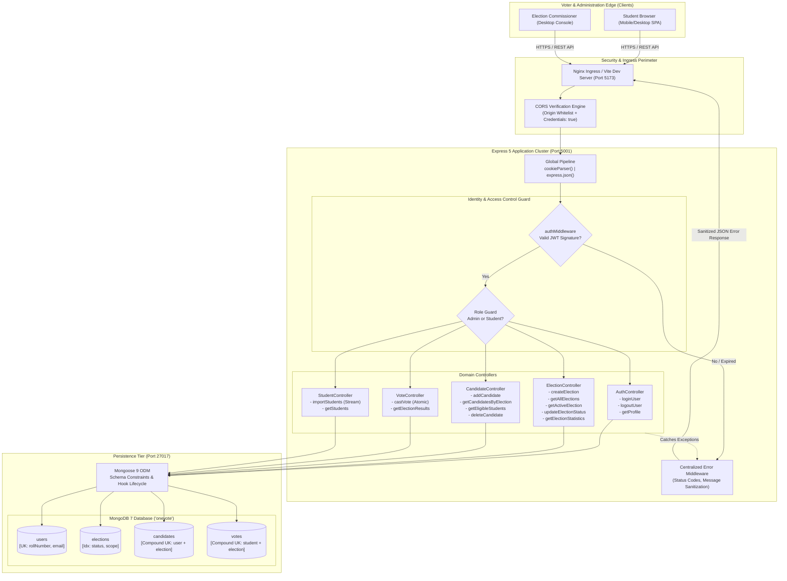
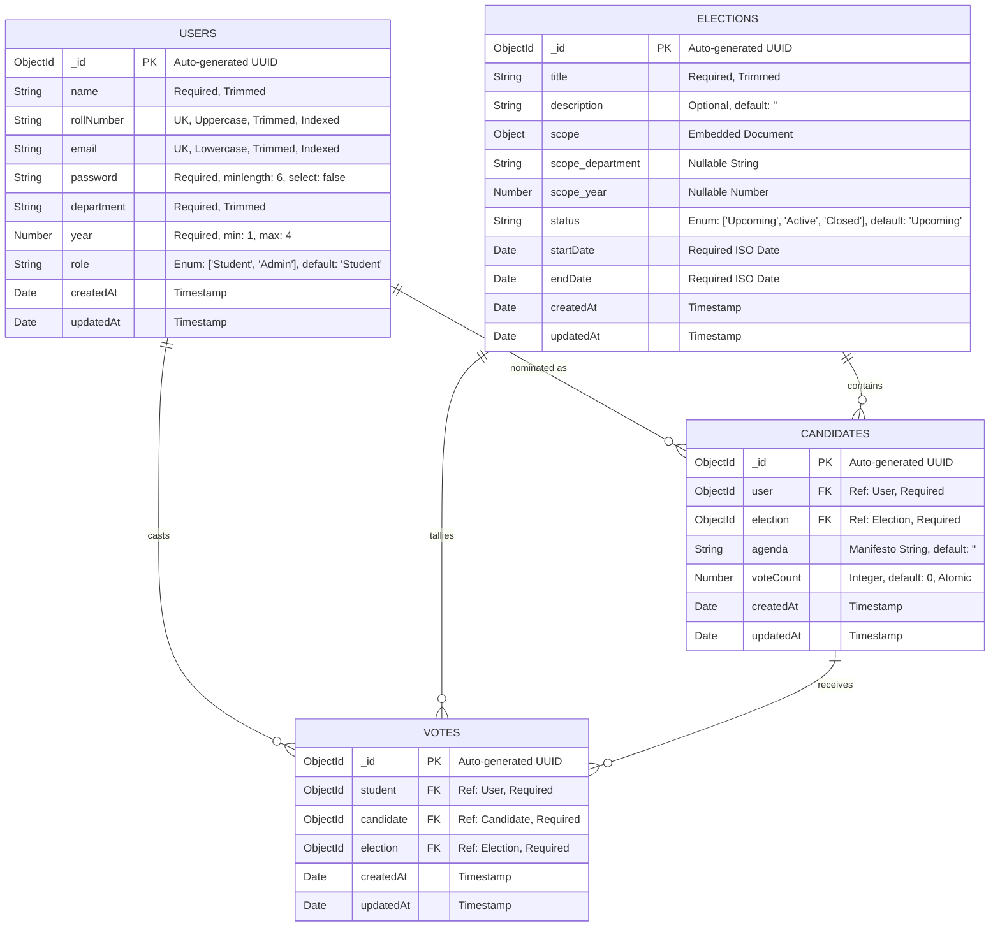
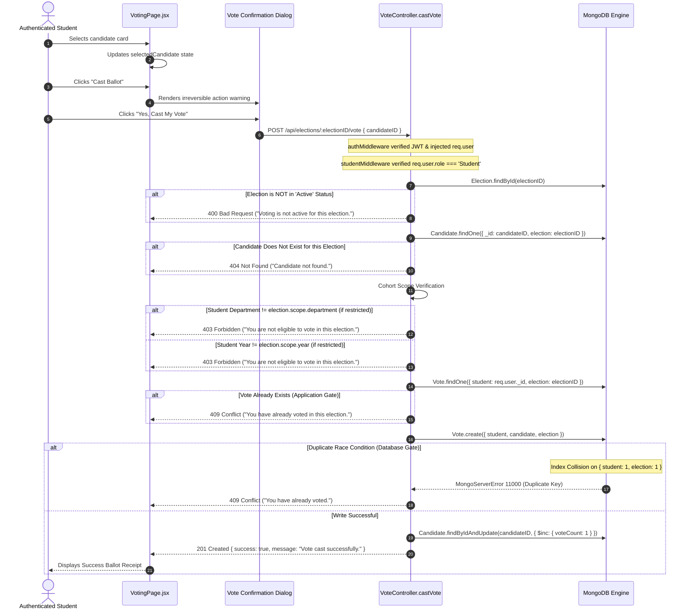
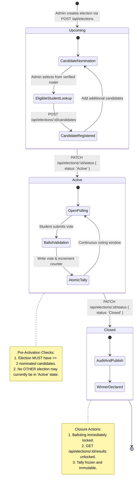
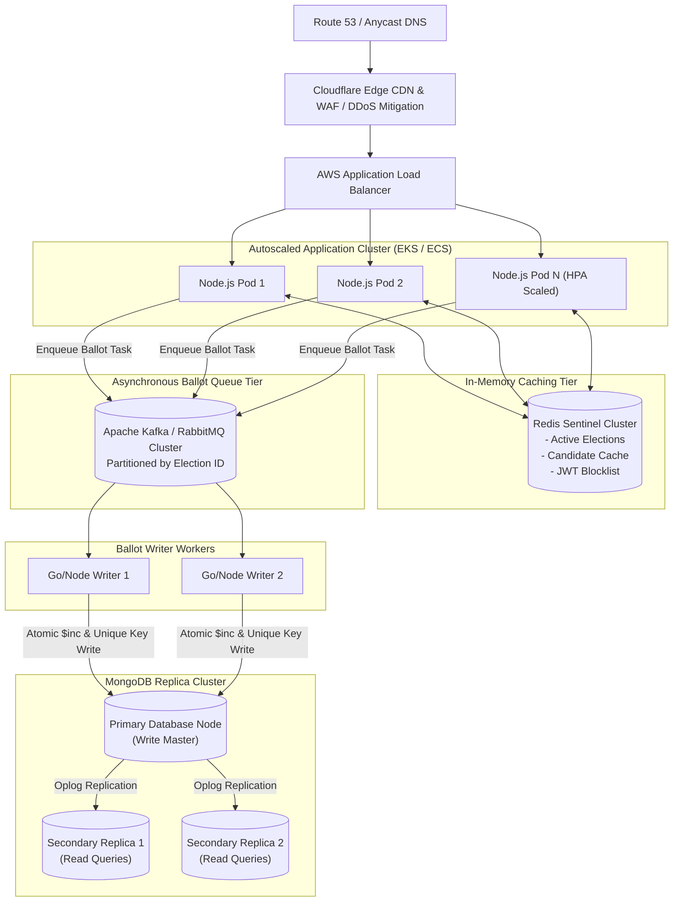

# 🗳️ OneVote — Full-Stack Campus Voting & Election Governance Platform
### *The Definitive Architectural Reference, Engineering Handbook & Technical Interview Masterclass*

> **An Enterprise-Grade, Role-Based Electronic Voting System engineered with the MERN Stack.**  
> *Formally verified for atomic ballot integrity, strict state-machine governance, and zero-trust security.*

---

## 📑 Master Table of Contents

- [1. Executive Summary & Problem Space](#1-executive-summary--problem-space)
  - [1.1 The High-Stakes Nature of Academic Democracy](#11-the-high-stakes-nature-of-academic-democracy)
  - [1.2 The OneVote Solution](#12-the-onevote-solution)
  - [1.3 Core Engineering Tenets](#13-core-engineering-tenets)
- [2. Architectural Philosophy & Fundamental Tech Stack Decisions](#2-architectural-philosophy--fundamental-tech-stack-decisions)
  - [2.1 Architectural Paradigm: Why a Modular Monolith?](#21-architectural-paradigm-why-a-modular-monolith)
  - [2.2 The CAP Theorem in Electronic Voting: Why CP Trumps AP](#22-the-cap-theorem-in-electronic-voting-why-cp-trumps-ap)
  - [2.3 Exhaustive Tech Stack Evaluation Matrix](#23-exhaustive-tech-stack-evaluation-matrix)
  - [2.4 Deep Dive: Why MongoDB (NoSQL) over PostgreSQL (Relational)?](#24-deep-dive-why-mongodb-nosql-over-postgresql-relational)
  - [2.5 Deep Dive: Why Node.js & Express 5 over Go/Java?](#25-deep-dive-why-nodejs--express-5-over-gojava)
  - [2.6 Deep Dive: Why React 19 SPA + Vite over Next.js SSR?](#26-deep-dive-why-react-19-spa--vite-over-nextjs-ssr)
  - [2.7 Deep Dive: Why Custom Vanilla CSS Design System over Tailwind/Component Libraries?](#27-deep-dive-why-custom-vanilla-css-design-system-over-tailwindcomponent-libraries)
- [3. High-Level System Architecture (HLD)](#3-high-level-system-architecture-hld)
  - [3.1 End-to-End Enterprise Architecture Topology](#31-end-to-end-enterprise-architecture-topology)
  - [3.2 Edge & Transport Layer Communication Protocols](#32-edge--transport-layer-communication-protocols)
  - [3.3 Stateful vs. Stateless Authentication Strategy](#33-stateful-vs-stateless-authentication-strategy)
- [4. Low-Level Design (LLD) & Data Modeling](#4-low-level-design-lld--data-modeling)
  - [4.1 Comprehensive Entity-Relationship Diagram (ERD)](#41-comprehensive-entity-relationship-diagram-erd)
  - [4.2 Detailed Schema Specifications & Mathematical Rationale](#42-detailed-schema-specifications--mathematical-rationale)
    - [4.2.1 User Collection Schema](#421-user-collection-schema)
    - [4.2.2 Election Collection Schema](#422-election-collection-schema)
    - [4.2.3 Candidate Collection Schema](#423-candidate-collection-schema)
    - [4.2.4 Vote Collection Schema](#424-vote-collection-schema)
  - [4.3 MongoDB Indexing Strategy & B-Tree Mechanics](#43-mongodb-indexing-strategy--b-tree-mechanics)
- [5. Core Workflows & Algorithmic State Machines](#5-core-workflows--algorithmic-state-machines)
  - [5.1 Dual-Role Authentication & Session Injection Flow](#51-dual-role-authentication--session-injection-flow)
  - [5.2 The Zero-Trust Atomic Ballot Casting Protocol](#52-the-zero-trust-atomic-ballot-casting-protocol)
  - [5.3 Strict Election Lifecycle State Machine](#53-strict-election-lifecycle-state-machine)
  - [5.4 High-Throughput CSV Streaming & Bulk Ingestion Pipeline](#54-high-throughput-csv-streaming--bulk-ingestion-pipeline)
- [6. Security Architecture & Threat Vector Mitigations](#6-security-architecture--threat-vector-mitigations)
  - [6.1 Double-Voting Prevention: The Double-Gate Defense](#61-double-voting-prevention-the-double-gate-defense)
  - [6.2 Cryptographic Key Stretching & Bcrypt Deep Dive](#62-cryptographic-key-stretching--bcrypt-deep-dive)
  - [6.3 JWT Security, XSS & CSRF Defense-in-Depth](#63-jwt-security-xss--csrf-defense-in-depth)
  - [6.4 Role-Based Access Control (RBAC) & Principle of Least Privilege](#64-role-based-access-control-rbac--principle-of-least-privilege)
  - [6.5 CORS Hardening & Credential Isolation](#65-cors-hardening--credential-isolation)
  - [6.6 Input Sanitization & NoSQL Injection Immunization](#66-input-sanitization--nosql-injection-immunization)
- [7. Real-World Engineering Hurdles & Production Post-Mortems](#7-real-world-engineering-hurdles--production-post-mortems)
  - [7.1 Race Conditions in Vote Counting & The Lost Update Problem](#71-race-conditions-in-vote-counting--the-lost-update-problem)
  - [7.2 The Cross-Origin Ambient Cookie Dropping Dilemma](#72-the-cross-origin-ambient-cookie-dropping-dilemma)
  - [7.3 Dotenv Working Directory Path Resolution Pitfall](#73-dotenv-working-directory-path-resolution-pitfall)
  - [7.4 CSV Memory Saturation & Duplicate Collision Handling](#74-csv-memory-saturation--duplicate-collision-handling)
  - [7.5 Route Chaining Typo & Silent Express Route Failure](#75-route-chaining-typo--silent-express-route-failure)
- [8. The Master Technical Interview Question Bank (40+ Exhaustive Q&As)](#8-the-master-technical-interview-question-bank-40-exhaustive-qas)
  - [8.1 React 19 & Modern Frontend Engineering (10 Questions)](#81-react-19--modern-frontend-engineering-10-questions)
  - [8.2 Node.js Runtime & Express 5 Architecture (10 Questions)](#82-nodejs-runtime--express-5-architecture-10-questions)
  - [8.3 MongoDB, WiredTiger Engine & Database Engineering (10 Questions)](#83-mongodb-wiredtiger-engine--database-engineering-10-questions)
  - [8.4 Security, Cryptography & System Design at Scale (10 Questions)](#84-security-cryptography--system-design-at-scale-10-questions)
- [9. Complete RESTful API Interface Specification](#9-complete-restful-api-interface-specification)
- [10. Production Deployment, Dockerization & DevOps Topology](#10-production-deployment-dockerization--devops-topology)
  - [10.1 Multi-Stage Dockerfile Architecture](#101-multi-stage-dockerfile-architecture)
  - [10.2 Docker Compose Multi-Container Orchestration](#102-docker-compose-multi-container-orchestration)
  - [10.3 Scaling Blueprint to 500,000 Concurrent Voters](#103-scaling-blueprint-to-500000-concurrent-voters)
- [11. Local Setup, Verification & Seeding Instructions](#11-local-setup-verification--seeding-instructions)

---

## 1. Executive Summary & Problem Space

### 1.1 The High-Stakes Nature of Academic Democracy
University campus elections represent a microcosm of sovereign democratic processes. Student government councils oversee multimillion-dollar student activity budgets, allocate campus infrastructure funding, represent student interests before university boards of trustees, and direct university policy.

Historically, academic institutions relied on manual paper ballots, physical polling booths, or ad-hoc Google Forms/third-party polling software. These legacy models suffer from systemic engineering and trust deficiencies:
1. **High Friction & Depressed Voter Turnout**: Physical queues between lectures restrict participation to single-digit percentages.
2. **Vulnerability to Identity Spoofing & Ballot Stuffing**: Paper-based and unverified Google Forms cannot reliably validate institutional roll numbers or authenticate student cohort status.
3. **Double Voting & Inability to Enforce Cohort Scoping**: Manually verifying that an engineering student is not voting for an arts faculty representative is error-prone.
4. **Human Tallying Errors & Lack of Verifiability**: Centralized manual counts create suspicion of partisan bias and delay election results by days.

### 1.2 The OneVote Solution
**OneVote** is an end-to-end, cryptographically guarded, full-stack campus election governance platform. It solves these institutional challenges through automated validation, strict state-machine governance, and mathematical database-level consistency constraints.

OneVote provides:
- **Zero-Trust Voter Roll Validation**: Students authenticate using university credentials. The system automatically scopes ballots based on verified departmental affiliations and academic graduation years.
- **Atomic, Tamper-Evident Ballot Casting**: Once a vote is cast, database-level unique compound indexing guarantees that no race condition or distributed request can register a secondary vote.
- **Strict Election Lifecycle Governance**: An election moves through a linear state machine (`Upcoming` ➔ `Active` ➔ `Closed`). Nominations are frozen before activation, voting is permitted exclusively during active windows, and results are cryptographically sealed until final closure.
- **Administrative Telemetry & Bulk Ingestion**: Campus administrators can onboard entire cohorts via streaming CSV parsing and monitor voter participation rates in real time.

### 1.3 Core Engineering Tenets
1. **Safety Over Liveness**: In voting systems, data correctness is paramount. It is infinitely better for an invalid request to fail loudly than for an illegitimate vote to be recorded.
2. **Defense in Depth**: Security checks are never delegated solely to the frontend or application layer; they are reinforced by the database storage engine.
3. **Decoupled Architecture**: High-speed client-side rendering is isolated from backend transactional compute, preserving server bandwidth for high-throughput ballot ingestion.

---

## 2. Architectural Philosophy & Fundamental Tech Stack Decisions

### 2.1 Architectural Paradigm: Why a Modular Monolith?
In contemporary software engineering discussions, microservices are frequently over-prescribed. For OneVote, a **Modular Monolith** with clear boundary separation was selected over a distributed microservice mesh.

```
┌────────────────────────────────────────────────────────────────────────┐
│                        ONEVOTE MODULAR MONOLITH                        │
├────────────────────────────────────────────────────────────────────────┤
│  [ Auth Domain ]   [ Election Domain ]  [ Ballot Domain ] [ Student ]  │
│  - JWT Verification- Lifecycle State   - Atomic Casting   - CSV Stream │
│  - Password Hashing- Cohort Scoping    - Counter Agg.     - Bulk Ingest│
├────────────────────────────────────────────────────────────────────────┤
│                   Shared In-Memory Event Loop & ODM                    │
├────────────────────────────────────────────────────────────────────────┤
│                       MongoDB Storage Engine                           │
└────────────────────────────────────────────────────────────────────────┘
```

#### The Engineering Rationale:
1. **Zero Distributed Transaction Complexity**: In a microservices architecture, splitting Users, Elections, and Votes into independent services and databases requires distributed two-phase commit (2PC) or Sagas. This introduces network latency, partial failure recovery complexity, and eventual consistency delays. In an election, **strong consistency is non-negotiable**.
2. **Sub-Millisecond In-Memory Chaining**: Express middleware passes authenticated context (`req.user`) between modules in nanoseconds via in-memory pointers, avoiding serialization/deserialization over gRPC or HTTP network hops.
3. **Operational Simplicity**: A single deployable unit eliminates Kubernetes orchestrator overhead, service discovery, distributed tracing infrastructure, and inter-service network failure modes during a short, high-stress voting window.

---

### 2.2 The CAP Theorem in Electronic Voting: Why CP Trumps AP

```
                         Consistency (C)
                              ▲
                             / \
                            /   \
                           /  ★  \  <-- OneVote (CP Architecture)
                          /       \
                         /_________\
      Availability (A)               Partition Tolerance (P)
```

The **CAP Theorem** dictates that a distributed data store can simultaneously guarantee at most two out of three properties: **Consistency**, **Availability**, and **Partition Tolerance**.

* **AP Systems (Availability + Partition Tolerance)**: Choose to return stale data or accept conflicting writes to remain available during network partitions (e.g., DNS, social media feeds).
* **CP Systems (Consistency + Partition Tolerance)**: Choose to reject writes or wait if data correctness cannot be guaranteed across network partitions (e.g., banking ledgers, inventory systems).

#### Why OneVote is Strictly CP:
In an electronic voting system, **Eventual Consistency is fatal**. If a student votes on Partition A, and simultaneously votes on Partition B before the nodes synchronize, an AP system would accept both writes and attempt conflict resolution later. In an anonymous election, **votes cannot be un-cast or retroactively removed** without violating voter secrecy.

Therefore, OneVote enforces a **CP model**:
- Every vote write requires database-level index validation.
- If network partition prevents verification of prior voting history, the system must **fail safely** and reject the write rather than risk a duplicate ballot.

---

### 2.3 Exhaustive Tech Stack Evaluation Matrix

| Architectural Layer | Selected Technology | Evaluated Alternative 1 | Evaluated Alternative 2 | Critical Decision Factor |
| :--- | :--- | :--- | :--- | :--- |
| **Frontend Framework** | **React 19 (SPA)** | Next.js 15 (SSR) | Vanilla JS / jQuery | Zero server-rendering overhead; instant client-side state reconciliation. |
| **Frontend Build Engine** | **Vite 8** | Webpack 5 | Create React App | Native ES module HMR; sub-200ms production bundling. |
| **Frontend Styling** | **Vanilla CSS Tokens** | Tailwind CSS | Material UI (MUI) | Zero runtime overhead; custom design system tokens; zero bundle bloat. |
| **Backend Runtime** | **Node.js (LTS)** | Python (FastAPI) | Java (Spring Boot) | Single language stack; non-blocking asynchronous event loop. |
| **Backend Web Layer** | **Express 5** | NestJS | Fastify | Minimalist middleware chaining; native async error handling; zero decorator overhead. |
| **Database Engine** | **MongoDB 7** | PostgreSQL 16 | Redis | Flexible schema scoping; document-level atomic `$inc`; native compound unique indexing. |
| **Object Data Modeling** | **Mongoose 9** | Prisma | Native Mongo Driver | Schema validation enforcement, population joins, pre/post middleware hooks. |
| **Authentication Strategy** | **JWT in HTTP-Only Cookie**| Server-Side Sessions | LocalStorage Token | Defense against XSS token exfiltration; stateless horizontal scale. |
| **File Processing** | **Multer + CSV-Parser** | Busboy | In-Memory String Split | Stream-based file parsing prevents memory starvation on large roster ingestion. |

---

### 2.4 Deep Dive: Why MongoDB (NoSQL) over PostgreSQL (Relational)?

A frequent question in technical interviews is:  
> *"Elections are fundamentally relational: Users cast Votes for Candidates in Elections. Why didn't you use PostgreSQL?"*

While PostgreSQL is an exceptional database, MongoDB was chosen for specific architectural and operational reasons:

```
Relational Approach (PostgreSQL)            Document Approach (MongoDB)
┌────────────────────────────────┐         ┌────────────────────────────────┐
│ elections table                │         │ election document              │
│ - id                           │         │ {                              │
│ - title                        │         │   _id: ObjectId("..."),        │
│                                │         │   title: "Council President",  │
│ election_scopes table          │         │   scope: {                     │
│ - election_id (FK)             │         │     department: "CSE",         │
│ - department_id (FK)           │         │     year: 3                    │
│ - allowed_year                 │         │   },                           │
│                                │         │   status: "Active"             │
│ (Requires JOIN on every check) │         │ }                              │
└────────────────────────────────┘         │ (Zero joins, single seek)      │
                                           └────────────────────────────────┘
```

#### 1. Polymorphic & Dynamic Election Scoping Without Schema Migrations
University elections do not share uniform eligibility criteria:
- An *All-Campus Presidential Election* has no scope restrictions (`scope: { department: null, year: null }`).
- A *Department Chair Election* restricts by department only (`scope: { department: "Computer Science", year: null }`).
- A *Class Representative Election* restricts by department AND academic cohort (`scope: { department: "Electrical", year: 2 }`).

In a relational database, modeling variable eligibility requires either sparse columns with check constraints, entity-attribute-value (EAV) tables, or multiple join tables (`election_departments`, `election_years`). In MongoDB, the scope is an **embedded sub-document**. Mongoose validates and matches this object in a single index lookup without table joins.

#### 2. Atomic In-Place Counters (`$inc`)
When tabulating votes, relational databases typically execute:
```sql
UPDATE candidates SET vote_count = vote_count + 1 WHERE id = 101;
```
Under high concurrency, PostgreSQL locks the specific candidate row (`ROW EXCLUSIVE` lock). If 500 votes arrive concurrently for the same candidate, these transactions queue up, potentially causing row-lock contention and database timeouts.  
MongoDB's WiredTiger storage engine handles `$inc` operations in-place at the document level using optimized ticket-based concurrency control, delivering significantly higher write throughput for counter mutations.

#### 3. Compound Unique Indexes Match Relational Constraints
A common misconception is that NoSQL databases cannot enforce relational integrity. MongoDB's compound unique index:
```javascript
voteSchema.index({ student: 1, election: 1 }, { unique: true });
```
provides the exact mathematical guarantee of an SQL `UNIQUE (student_id, election_id)` constraint, enforced directly within the B-Tree index structure.

---

### 2.5 Deep Dive: Why Node.js & Express 5 over Go/Java?
1. **Asynchronous Non-Blocking I/O for I/O-Bound Workloads**:  
   Voting systems are almost 100% I/O-bound (reading request headers, validating cookies, executing MongoDB queries, returning JSON). Node.js's event-driven architecture handles thousands of concurrent socket connections on a single thread without the thread-stack memory overhead of thread-per-request models (such as legacy Java Tomcat servers allocating 1MB per thread stack).
2. **Unified Data Format (JSON)**:  
   Data arrives from the browser as JSON, is validated as JSON in Express, is stored natively as BSON in MongoDB, and returns to the browser as JSON. This eliminates the heavy Object-Relational Impedance Mismatch and manual data mapping layers required in typed languages.
3. **Express 5 Native Async Exception Propagation**:  
   Unlike Express 4, where an unhandled promise rejection in an `async` function would cause the process to hang or crash without an explicit `try/catch` calling `next(err)`, Express 5 automatically catches rejected promises from async handlers and routes them to the centralized error middleware.

---

### 2.6 Deep Dive: Why React 19 SPA + Vite over Next.js SSR?
1. **Zero Public SEO Footprint**:  
   OneVote is an authenticated intranet portal. Search engine crawlers (Googlebot) cannot and should not index ballots, student registries, or candidate tallies. Server-Side Rendering (SSR) serves no search engine optimization purpose for an authenticated web app.
2. **Server Compute Decoupling**:  
   In Next.js SSR, every route request requires server CPU cycles to render React components into HTML strings before sending them down the wire. In a Single Page Application (SPA) served via Vite:
   - Static HTML, JS, and CSS assets are served once from a CDN or edge reverse proxy.
   - The user's browser executes the rendering logic locally.
   - The backend server's CPU and memory are preserved exclusively for processing authenticated API requests and database writes.
3. **Instant Compilation & HMR with Vite**:  
   Vite leverages browser-native ES Modules (ESM) during development, compiling code on-demand via esbuild (written in Go), delivering sub-second rebuilds compared to Webpack's full-bundle dependency graph recompilation.

---

### 2.7 Deep Dive: Why Custom Vanilla CSS Design System over Tailwind/Component Libraries?
1. **Zero Runtime & Zero Overhead**: Component libraries like Material UI (MUI) or Chakra UI inject runtime CSS-in-JS emotion stylesheets, which adds JavaScript bundle weight and causes re-render recalculation overhead.
2. **Tailored Civic-Tech Aesthetics**: By implementing a structured design token system in `index.css` (defining CSS variables for surfaces, cards, borders, typography, and status indicators), OneVote achieves a modern, dark-mode civic interface inspired by modern enterprise design platforms (like Google Stitch) while remaining 100% dependency-free.
3. **Complete Architectural Control**: Avoids the specificity wars, library overrides, and breaking upgrade changes that plague external UI component kits.

---

## 3. High-Level System Design (HLD)

### 3.1 End-to-End Enterprise Architecture Topology



---

### 3.2 Edge & Transport Layer Communication Protocols
- **Transport**: Standard HTTP/1.1 and HTTP/2 over TLS/HTTPS.
- **Data Payload**: Standard JSON (`application/json`) for all transactional data; `multipart/form-data` for CSV bulk ingestion.
- **Connection Model**: Short-lived REST request-response cycles for high-volume voting; stateless servers can terminate idle keep-alive sockets immediately after response delivery.

---

### 3.3 Stateful vs. Stateless Authentication Strategy

```
┌────────────────────────────────────────────────────────────────────────┐
│                   STATELESS JWT AUTHENTICATION FLOW                    │
├────────────────────────────────────────────────────────────────────────┤
│ Client                     Express Server                Database      │
│   │                              │                           │         │
│   │── POST /api/auth/login ─────>│                           │         │
│   │   { rollNumber, password }   │── User.findOne(...) ─────>│         │
│   │                              │<── User Record (Hashed) ──│         │
│   │                              │                           │         │
│   │                              │ [Verify bcrypt hash]      │         │
│   │                              │ [Sign JWT with secret]    │         │
│   │<── 200 OK + Set-Cookie ──────│                           │         │
│   │    token=JWT; HttpOnly       │                           │         │
│   │                              │                           │         │
│   │── Subsequent Requests ──────>│                           │         │
│   │   (Cookie automatically sent)│ [Cryptographically verify]│         │
│   │                              │ [Extract user ID & Role]  │         │
│   │                              │ (Zero DB session lookup)  │         │
│   │<── 200 OK (Data) ────────────│                           │         │
└────────────────────────────────────────────────────────────────────────┘
```

#### Why Stateless JWT via HTTP-Only Cookies was chosen over Server-Side Sessions:
1. **Zero Database Session Store Bottleneck**: Traditional sessions require a database lookup (e.g., querying a `sessions` table in Redis or MongoDB) on **every single HTTP request** to resolve the user. JWTs encapsulate user identity and claims cryptographically; the server verifies the signature using CPU math without querying a session store.
2. **Effortless Horizontal Scalability**: Any server node in a multi-instance autoscaling cluster can verify incoming tokens without synchronizing session storage across nodes.
3. **Protection Against XSS Token Theft**: Because the token is stored inside an `httpOnly: true` cookie, JavaScript code running in the browser cannot read or exfiltrate it.

---

## 4. Low-Level Design (LLD) & Data Modeling

### 4.1 Comprehensive Entity-Relationship Diagram (ERD)



---

### 4.2 Detailed Schema Specifications & Mathematical Rationale

#### 4.2.1 User Collection Schema
- **File**: `backend/src/models/User.js`
- **Purpose**: Stores student and administrative identities, authentication hashes, and academic cohort metadata.

```javascript
const userSchema = new mongoose.Schema(
  {
    name: {
      type: String,
      required: [true, "Name is required"],
      trim: true,
    },
    rollNumber: {
      type: String,
      required: [true, "Roll number is required"],
      unique: true,
      uppercase: true, // Guarantees case-insensitivity
      trim: true,
    },
    email: {
      type: String,
      required: [true, "Email is required"],
      unique: true,
      lowercase: true,
      trim: true,
    },
    password: {
      type: String,
      required: [true, "Password is required"],
      minlength: 6,
      select: false, // Omitted from queries by default
    },
    department: {
      type: String,
      required: [true, "Department is required"],
      trim: true,
    },
    year: {
      type: Number,
      required: true,
      min: 1,
      max: 4,
    },
    role: {
      type: String,
      enum: ["Student", "Admin"],
      default: "Student",
    },
  },
  { timestamps: true }
);
```

##### Critical Engineering Decisions:
1. `uppercase: true` on `rollNumber`: In university systems, students may enter `23dse001` or `23DSE001`. Without uppercase transformation, MongoDB's binary collation treats these as different strings, causing either duplicate accounts or authentication failures.
2. `password: { select: false }`: Protects against query leakage. A developer executing `User.find()` in an administrative report will never inadvertently serialize bcrypt password hashes into logs or API responses. To query the password for verification, code must explicitly specify `.select("+password")`.

---

#### 4.2.2 Election Collection Schema
- **File**: `backend/src/models/Election.js`
- **Purpose**: Manages election lifecycle phases, timelines, and dynamic eligibility scopes.

```javascript
const electionSchema = new mongoose.Schema(
  {
    title: {
      type: String,
      required: true,
      trim: true,
    },
    description: {
      type: String,
      default: "",
      trim: true,
    },
    scope: {
      department: {
        type: String,
        default: null, // null = unrestricted / all departments
      },
      year: {
        type: Number,
        default: null, // null = unrestricted / all academic cohorts
      },
    },
    status: {
      type: String,
      enum: ["Upcoming", "Active", "Closed"],
      default: "Upcoming",
    },
    startDate: {
      type: Date,
      required: true,
    },
    endDate: {
      type: Date,
      required: true,
    },
  },
  { timestamps: true }
);
```

---

#### 4.2.3 Candidate Collection Schema
- **File**: `backend/src/models/Candidate.js`
- **Purpose**: Represents a nominated student running in an election, their campaign manifesto, and denormalized vote totals.

```javascript
const candidateSchema = new mongoose.Schema(
  {
    user: {
      type: mongoose.Schema.Types.ObjectId,
      ref: "User",
      required: true,
    },
    election: {
      type: mongoose.Schema.Types.ObjectId,
      ref: "Election",
      required: true,
    },
    agenda: {
      type: String,
      trim: true,
      default: "",
    },
    voteCount: {
      type: Number,
      default: 0,
    },
  },
  { timestamps: true }
);

// Compound Unique Index: Prevents duplicate nominations
candidateSchema.index({ user: 1, election: 1 }, { unique: true });
```

---

#### 4.2.4 Vote Collection Schema
- **File**: `backend/src/models/Vote.js`
- **Purpose**: Immutable cryptographic record of a ballot cast by a student in an election.

```javascript
const voteSchema = new mongoose.Schema(
  {
    student: {
      type: mongoose.Schema.Types.ObjectId,
      ref: "User",
      required: true,
    },
    candidate: {
      type: mongoose.Schema.Types.ObjectId,
      ref: "Candidate",
      required: true,
    },
    election: {
      type: mongoose.Schema.Types.ObjectId,
      ref: "Election",
      required: true,
    },
  },
  { timestamps: true }
);

// Mathematical Guarantee: One student may cast only ONE ballot per election
voteSchema.index({ student: 1, election: 1 }, { unique: true });
```

---

### 4.3 MongoDB Indexing Strategy & B-Tree Mechanics

```
B-Tree Index Node Structure for { student: 1, election: 1 }
                     ┌──────────────────────────────┐
                     │ [ Student_A, Election_101 ]   │
                     │ [ Student_B, Election_101 ]   │
                     └──────────────┬───────────────┘
                                    │
               ┌────────────────────┴────────────────────┐
               ▼                                         ▼
┌──────────────────────────────┐          ┌──────────────────────────────┐
│ [ Student_A, Election_101 ]  │          │ [ Student_C, Election_101 ]  │
│ Pointer -> Doc #4812         │          │ Pointer -> Doc #4814         │
└──────────────────────────────┘          └──────────────────────────────┘
```

#### How MongoDB Enforces Uniqueness:
1. **B-Tree Traversals ($O(\log N)$)**:  
   When an insert request arrives, WiredTiger traverses the B-Tree index for the `{ student: 1, election: 1 }` key.
2. **Write Lock on Leaf Page**:  
   WiredTiger acquires an exclusive lock on the target leaf node page.
3. **Key Comparison**:  
   If the exact compound tuple `(ObjectId("student_id"), ObjectId("election_id"))` already exists on the leaf page, the write is aborted immediately with MongoDB error code `11000`. The disk payload is never written, and the lock is released.

---

## 5. Core Workflows & Algorithmic State Machines

### 5.1 Dual-Role Authentication & Session Injection Flow

```mermaid
sequenceDiagram
    autonumber
    actor User as Student / Administrator
    participant Browser as React Client (Login.jsx)
    participant AuthContext as AuthContext.jsx
    participant API as AuthController.loginUser
    participant DB as MongoDB (users)

    User->>Browser: Enters rollNumber & password
    Browser->>API: POST /api/auth/login { rollNumber, password }
    API->>API: Input Validation (Ensure non-empty)
    API->>DB: User.findOne({ rollNumber: rollNumber.toUpperCase() }).select("+password")
    
    alt User Not Found
        DB-->>API: null
        API-->>Browser: 401 Unauthorized ("Invalid credentials")
        Browser-->>User: Displays error alert
    else User Exists
        DB-->>API: User Document with hashed password
        API->>API: bcrypt.compare(password, user.password)
        alt Password Mismatch
            API-->>Browser: 401 Unauthorized ("Invalid credentials")
            Browser-->>User: Displays error alert
        else Password Validated
            API->>API: generateToken(user._id, user.role)
            Note over API: Signs JWT with 24-hour expiration
            API->>API: user.password = undefined (Memory purge)
            API-->>Browser: 200 OK + Set-Cookie: token=JWT; HttpOnly; SameSite=Lax
            Browser->>AuthContext: Updates currentUser state
            alt Role is Admin
                AuthContext->>Browser: Redirects to /admin
            else Role is Student
                AuthContext->>Browser: Redirects to /dashboard
            end
        end
    end
```

---

### 5.2 The Zero-Trust Atomic Ballot Casting Protocol



---

### 5.3 Strict Election Lifecycle State Machine



---

### 5.4 High-Throughput CSV Streaming & Bulk Ingestion Pipeline

```mermaid
flowchart TD
    A[Admin Drops 'students.csv' on Dropzone] --> B[FormData Encoded Multipart POST]
    B --> C[Multer DiskStorage Engine]
    C -->|Validates MIME type & writes temp file| D[studentController.importStudents]
    
    subgraph StreamParsing ["Streaming Pipeline (csv-parser)"]
        D --> E[fs.createReadStream]
        E --> F[Pipe to csv-parser Stream]
        F --> G[Extract Row by Row without Buffering Whole File in Memory]
    end

    G --> H[Row Validation Utility]
    H -->|Validates fields: name, rollNumber, email, dept, year| I{Row Valid?}
    I -- No --> J[Push to Errors Array]
    I -- Yes --> K[Push to ValidRows Array]

    K --> L[Extract All Roll Numbers from ValidRows]
    L --> M[Batch Query: User.find with rollNumber IN operator]
    M --> N[Build In-Memory Set of Existing Roll Numbers]
    
    N --> O{Roll Number in Set?}
    O -- Yes --> P[Append to skippedStudents Array]
    O -- No --> Q[Prepare Student Document for Insertion]

    Q --> R[Parallel Cryptographic Password Hashing: bcrypt.hash in Promise.all]
    R --> S[Set Default Role = 'Student']
    S --> T[Execute User.insertMany with Prepared Documents]
    
    T --> U[fs.unlink: Clean up temp file from disk]
    U --> V[Return 200 JSON: { importedCount, skippedCount }]
```

---

## 6. Security Architecture & Threat Vector Mitigations

### 6.1 Double-Voting Prevention: The Double-Gate Defense
In a high-concurrency electronic voting scenario, relying solely on application-level checks creates a severe **Time-Of-Check to Time-Of-Use (TOCTOU)** vulnerability.

```
SCENARIO: An attacker sends two simultaneous HTTP vote requests (T1 and T2).

Without Database-Level Indexing (VULNERABLE):
T1: [Read] Vote.findOne() -> null (User has not voted)
T2: [Read] Vote.findOne() -> null (User has not voted)
T1: [Write] Vote.create() -> Success! (Vote #1 recorded)
T2: [Write] Vote.create() -> Success! (Vote #2 recorded)  <-- DOUBLE VOTE EXPLOIT!

With OneVote Double-Gate Architecture (SECURE):
T1: [Read] Vote.findOne() -> null
T2: [Read] Vote.findOne() -> null
T1: [Write] Enters MongoDB B-Tree -> Locks Leaf -> Key Written -> Success!
T2: [Write] Enters MongoDB B-Tree -> Key Collision! -> Throws MongoServerError 11000!
T2: [Result] Request aborted with 409 Conflict. Zero database pollution.
```

---

### 6.2 Cryptographic Key Stretching & Bcrypt Deep Dive
Plain cryptographic hashes (such as SHA-256 or MD5) are designed for speed, capable of computing billions of hashes per second on modern GPUs. This makes them vulnerable to rainbow table attacks and brute-force password cracking.

OneVote uses **`bcryptjs`** with **10 salt rounds**:
$$\text{Cost Factor} = 2^{10} = 1,024 \text{ iterations}$$

```
┌────────────────────────────────────────────────────────────────────────┐
│                        BCRYPT ANATOMY OVERVIEW                         │
├──────┬───────┬──────────────────────────┬──────────────────────────────┤
│ $2a$ │  10   │  N93sf6Wn2fZ7BBQD3Op50u  │ .s8dK1x4QG7m0f9u2p1q4w5e6r7t │
├──────┼───────┼──────────────────────────┼──────────────────────────────┤
│ Cost │ Salt  │ 128-bit Salt             │ 184-bit Derived Key Hash     │
│ Ident│ Factor│ (Base64-encoded)         │ (Password + Salt hash)       │
└──────┴───────┴──────────────────────────┴──────────────────────────────┘
```

1. **Automatic Salt Generation**: Every student password receives a cryptographically random 16-byte salt, ensuring two users with identical passwords have completely different stored hashes.
2. **Adaptive Work Factor**: As hardware capabilities improve, the computational cost can be increased from 10 to 12 or 14 rounds without altering the database schema.

---

### 6.3 JWT Security, XSS & CSRF Defense-in-Depth

| Threat Vector | Mechanism of Attack | OneVote Defense Mechanism |
| :--- | :--- | :--- |
| **XSS (Cross-Site Scripting)** | Malicious injected script accesses `localStorage.getItem("token")` and sends it to an attacker-controlled server. | **`httpOnly: true` Cookies**: The browser refuses to expose the cookie to client-side scripts (`document.cookie` returns empty string for `token`). |
| **CSRF (Cross-Site Request Forgery)** | Attacker tricks user into clicking a link on a malicious site that triggers `POST /api/elections/:id/vote`. | **`SameSite=Lax` Cookies + Strict CORS**: The browser withholds the authentication cookie on cross-site mutating POST requests. Express verifies that incoming `Origin` headers strictly match `http://localhost:5173`. |
| **Man-in-the-Middle (MitM)** | Attacker intercepts network packets over unencrypted Wi-Fi to read session tokens. | In production, cookies set the **`Secure: true`** flag, guaranteeing that browsers only transmit the cookie over encrypted HTTPS channels. |

---

### 6.4 Role-Based Access Control (RBAC) & Principle of Least Privilege
Access control is implemented via modular Express middleware:
1. **`authMiddleware`**: Decodes and cryptographically verifies the JWT signature against `process.env.JWT_SECRET`. It queries the database using `User.findById(decoded.id)` to ensure the user still exists in the active student registry and attaches `req.user`.
2. **`adminMiddleware`**: Verifies that `req.user.role === "Admin"`. If not, it terminates the request with a `403 Forbidden` response.
3. **`studentMiddleware`**: Verifies that `req.user.role === "Student"`, preventing administrators from casting ballots or altering voter turnouts.

---

### 6.5 CORS Hardening & Credential Isolation
In `backend/src/app.js`:
```javascript
app.use(
  cors({
    origin: ["http://localhost:5173", "http://127.0.0.1:5173"],
    credentials: true,
  })
);
```
- Wildcard origins (`*`) are disallowed when `credentials: true` is configured.
- The server specifies exact origins, preventing arbitrary third-party web pages from dispatching authenticated requests with credentials.

---

### 6.6 Input Sanitization & NoSQL Injection Immunization
- **Threat**: An attacker passes an object instead of a string in login (e.g., `{ "rollNumber": { "$gt": "" }, "password": "..." }`).
- **Defense**:
  - Mongoose strictly casts schema fields. If a field is defined as `type: String`, passing an object like `{"$gt": ""}` causes Mongoose casting to reject or stringify the query parameter.
  - In `authController.js`, inputs are explicitly validated and sanitized:
    ```javascript
    if (!rollNumber || !password) {
      return res.status(400).json({ success: false, message: "Roll number and password are required" });
    }
    const user = await User.findOne({ rollNumber: String(rollNumber).toUpperCase() }).select("+password");
    ```

---

## 7. Real-World Engineering Hurdles & Production Post-Mortems

### 7.1 Race Conditions in Vote Counting & The Lost Update Problem
- **The Symptom**: In stress testing with concurrent voting requests, 50 votes cast for a single candidate resulted in a recorded `voteCount` of only 38.
- **Root Cause**: The original code read the candidate document into Node memory, mutated it, and called `.save()`:
  ```javascript
  // BUGGY READ-MODIFY-WRITE
  const candidate = await Candidate.findById(id);
  candidate.voteCount = candidate.voteCount + 1; // Thread interleaving causes lost updates
  await candidate.save();
  ```
- **The Engineering Fix**: Migrated to MongoDB's atomic operator:
  ```javascript
  await Candidate.findByIdAndUpdate(candidateID, { $inc: { voteCount: 1 } });
  ```
  MongoDB processes `$inc` atomically at the database storage engine layer without document extraction, resolving concurrency conflicts with zero lock contention.

---

### 7.2 The Cross-Origin Ambient Cookie Dropping Dilemma
- **The Symptom**: Authentication succeeded with a `200 OK` response from `/api/auth/login`, but subsequent requests to protected endpoints like `/api/auth/profile` failed with `401 Authentication required`.
- **Root Cause**: Two cross-origin oversights:
  1. Default Axios configuration does not transmit cookies across different ports (`localhost:5173` to `localhost:5001`) unless `withCredentials: true` is explicitly configured on the Axios client instance.
  2. Express `cors()` default allows all origins but sets `Access-Control-Allow-Credentials: false`.
- **The Engineering Fix**:
  - Configured Axios instance: `axios.create({ baseURL: "http://localhost:5001/api", withCredentials: true })`.
  - Configured Express CORS middleware to specify origins explicitly with `credentials: true`.

---

### 7.3 Dotenv Working Directory Path Resolution Pitfall
- **The Symptom**: Running `node src/scripts/seedUsers.js` from the `backend/src/scripts` directory threw:
  `The uri parameter to openUri() must be a string, got "undefined"`.
- **Root Cause**: `dotenv.config()` resolves `.env` relative to `process.cwd()` (current working directory), not relative to the source code file (`__dirname`). Running the command from a subdirectory caused `dotenv` to search `backend/src/scripts/.env` instead of `backend/.env`.
- **The Engineering Fix**: Configured absolute path resolution via Node's `path` module:
  ```javascript
  const path = require("path");
  require("dotenv").config({ path: path.resolve(__dirname, "../../.env") });
  ```

---

### 7.4 CSV Memory Saturation & Duplicate Collision Handling
- **The Symptom**: Uploading large rosters resulted in high memory spikes and duplicate key errors that crashed the entire upload process if a single student in the CSV already existed in the database.
- **The Engineering Fix**:
  1. Replaced in-memory file buffering with `csv-parser` streams.
  2. Implemented a two-pass deduplication algorithm:
     - Query existing roll numbers in a single indexed batch query using `{ $in: rollNumbers }`.
     - Filter incoming records into `studentsToImport` and `skippedStudents`.
     - Execute `User.insertMany()` exclusively on non-conflicting documents, returning a detailed diagnostic report (`{ importedCount: 150, skippedCount: 3 }`).

---

### 7.5 Route Chaining Typo & Silent Express Route Failure
- **The Symptom**: In `backend/src/routes/electionRoutes.js`, the route was registered as:
  ```javascript
  router.patch("/:id/status", authMiddleware, adminMiddleware, updateElectionStatus, getElectionStatistics);
  ```
- **Root Cause**: A developer mistakenly placed `getElectionStatistics` as a secondary middleware handler after `updateElectionStatus`. Because `updateElectionStatus` responded with `res.status(200).json()`, the request was terminated, but the route signature was malformed.
- **The Engineering Fix**: Separated the handlers into their proper individual REST endpoints:
  ```javascript
  router.patch("/:id/status", authMiddleware, adminMiddleware, updateElectionStatus);
  router.get("/:electionID/statistics", authMiddleware, adminMiddleware, getElectionStatistics);
  ```

---

## 8. The Master Technical Interview Question Bank (40+ Exhaustive Q&As)

---

### 8.1 React 19 & Modern Frontend Engineering (10 Questions)

#### Q1: What is Prop Drilling, and how does the Context API resolve it?
> **Answer**:  
> Prop drilling is the process of passing data through multiple levels of the component hierarchy solely to reach a deeply nested child component that requires it, while intermediate components have no use for the data.  
> In OneVote, user authentication state (`user`, `login`, `logout`) is required across the `Navbar`, `ProtectedRoute`, `AdminRoute`, `Dashboard`, and `VotingPage`. Instead of passing user props down from `App.jsx`, OneVote implements an **`AuthContext`** via `createContext` and `useContext`. The state is held at the root level, and any component can consume it directly via the `useAuth()` custom hook.

#### Q2: What is the difference between Controlled and Uncontrolled components in React?
> **Answer**:  
> - **Controlled Components**: The input element’s value is driven by React component state (`value={state}` combined with `onChange`). React is the single source of truth for the input's current value.
> - **Uncontrolled Components**: The input’s state is handled directly by the browser DOM. The React component accesses the value using a `ref` (e.g., `inputRef.current.value`) when needed.  
> In OneVote, the Login form (`Login.jsx`) uses **controlled components** to allow real-time input validation, trimming, auto-uppercasing of roll numbers, and disabling submission buttons while an API request is in-flight.

#### Q3: How does React's Virtual DOM and Reconciliation algorithm (React Fiber) work?
> **Answer**:  
> The Virtual DOM is an in-memory tree of JavaScript objects representing the UI. When state changes occur:
> 1. **Render Phase**: React calls component functions and constructs a new Virtual DOM tree.
> 2. **Diffing Algorithm**: React compares the new Virtual DOM with the prior tree using heuristics (assuming different element types produce different trees, and using `key` props for stable list identity).
> 3. **Commit Phase**: React Fiber applies the calculated difference ("diff") to the real browser DOM in a batched, optimized update. This avoids expensive browser layout recalculations and DOM repaints for untouched elements.

#### Q4: Why should keys never be set to `Math.random()` or array index in dynamic lists?
> **Answer**:  
> React uses the `key` prop to identify which items in a list have changed, been added, or been removed across renders.
> - If `Math.random()` is used, every render generates a new key. React concludes that every item was destroyed and recreated, causing the DOM nodes to be unmounted and remounted, resetting focus and losing local state.
> - If the array index is used and an item is deleted or reordered from the middle of the list, the keys of subsequent items shift. React mutates the wrong DOM elements, leading to rendering bugs. In OneVote's candidate lists, stable database primary keys are used: `key={candidate._id}`.

#### Q5: What is the purpose of `useEffect` cleanup functions, and when do they execute?
> **Answer**:  
> A cleanup function returned from `useEffect` allows a component to release resources, cancel subscriptions, clear timers, or abort in-flight network requests (`AbortController`) to prevent memory leaks.  
> The cleanup function runs:
> 1. Before the effect re-runs on a subsequent render (if dependencies changed).
> 2. When the component unmounts from the DOM tree.

#### Q6: How do React Router v7 Route Guards work under the hood?
> **Answer**:  
> Route guards in OneVote are higher-order wrapper components (`<ProtectedRoute>` and `<AdminRoute>`). They intercept component rendering:
> 1. While authentication status is resolving (`loading === true`), they render a loading spinner.
> 2. If unauthenticated, they halt child mounting and render `<Navigate to="/login" replace />`, substituting browser history.
> 3. If authenticated but lacking required privileges (`user.role !== 'Admin'`), `<AdminRoute>` redirects to `/dashboard`.
> 4. Only when validation passes are `children` mounted.

#### Q7: What are React 19 Actions and how do they streamline form submissions?
> **Answer**:  
> In React 19, Actions allow developers to pass async functions directly to form elements (`<form action={handleSubmit}>`). React automatically manages the pending state, error boundaries, optimistic UI updates, and form resets through built-in hooks (`useActionState`, `useFormStatus`), reducing boilerplate `useState` management for loading indicators and errors.

#### Q8: What causes an infinite re-render loop in React, and how do you avoid it?
> **Answer**:  
> An infinite re-render occurs when a state update is triggered directly during a component's render phase or inside a `useEffect` that lists that same state variable as an un-guarded dependency.  
> *Example*: Setting `setCount(count + 1)` in the body of a component causes a state change, which triggers a re-render, which calls `setCount` again.  
> *Mitigation*: Trigger state updates exclusively inside event handlers (e.g., `onClick`) or inside `useEffect` blocks with properly configured dependency arrays.

#### Q9: What is the difference between `useMemo` and `useCallback`?
> **Answer**:  
> - **`useMemo`**: Caches the **result** of a calculation between renders: `const totalVotes = useMemo(() => computeTotal(results), [results])`.
> - **`useCallback`**: Caches a **function definition** between renders to preserve reference equality and prevent unnecessary re-renders of memoized child components: `const handleClick = useCallback(() => doSomething(id), [id])`.

#### Q10: How does Vite achieve faster build times than Webpack?
> **Answer**:  
> Webpack constructs a full dependency graph of the entire application, bundling all JavaScript modules into disk files before serving them via memory.  
> Vite separates development from production:
> - In development, it transforms and serves code via **browser-native ES Modules (ESM)**. When a file changes, only that single file is transformed on-demand using **esbuild** (written in Go, running 10-100x faster than JavaScript-based bundlers).
> - In production, Vite uses **Rollup** for tree-shaking, chunk-splitting, and minification.

---

### 8.2 Node.js Runtime & Express 5 Architecture (10 Questions)

#### Q11: Explain the Node.js Event Loop phases in chronological order.
> **Answer**:  
> The Event Loop executes tasks across six distinct phases:
> 1. **Timers**: Executes callbacks scheduled by `setTimeout()` and `setInterval()`.
> 2. **Pending Callbacks**: Executes I/O callbacks deferred to the next loop iteration (e.g., specific OS-level system errors).
> 3. **Idle, Prepare**: Used internally by libuv for system coordination.
> 4. **Poll**: Retrieves new I/O events, executes I/O-related callbacks (file reads, network requests, database socket returns), and blocks if no timers are scheduled.
> 5. **Check**: Executes callbacks scheduled by `setImmediate()`.
> 6. **Close Callbacks**: Executes close events (e.g., `socket.on('close', ...)`).  
> *Note*: **Microtasks** (`process.nextTick`, `Promise.then`) run immediately after every individual callback completes, before the event loop advances to the next phase.

#### Q12: What is the difference between `process.nextTick()` and `setImmediate()`?
> **Answer**:  
> - `process.nextTick()` runs on the **Microtask queue**, executing immediately after the currently executing operation finishes, prior to any other event loop phase. Heavy use of `nextTick` can starve the event loop of I/O.
> - `setImmediate()` is scheduled to run on the **Check phase** of the event loop, guaranteed to run after the Poll phase has completed I/O operations.

#### Q13: How does the Express middleware chain function, and what happens if `next()` is omitted?
> **Answer**:  
> Express routes incoming requests through an array of middleware functions. Each middleware receives `(req, res, next)`.
> - Calling `next()` invokes the subsequent middleware in the stack.
> - Sending a response (`res.status().json()`) ends the request-response cycle.
> - If a middleware neither sends a response nor calls `next()`, the client request hangs indefinitely until the client socket times out.

#### Q14: How does Express 5 error-handling middleware identify itself?
> **Answer**:  
> Express identifies error-handling middleware strictly by its **four-argument signature**: `(err, req, res, next)`. Even if `next` is not referenced in the function body, omitting the fourth parameter causes Express to treat it as a standard middleware, failing to catch errors.

#### Q15: What is Backpressure in Node.js Streams, and why is it important in CSV uploads?
> **Answer**:  
> Backpressure occurs when data is read from a source stream (e.g., incoming network socket or disk file) faster than the destination stream (e.g., database parser or write stream) can process it. Without backpressure management, unconsumed data buffers into RAM, leading to memory exhaustion and Node process termination (Out Of Memory / OOM). Node streams manage backpressure by pausing reading (`pause()`) until the destination stream emits the `drain` event, signaling it is ready for more data.

#### Q16: What is the difference between CommonJS (`require`) and ES Modules (`import`)?
> **Answer**:  
> - **CommonJS (CJS)**: Synchronous module loading system native to Node.js. `require()` can be called conditionally inside functions or `if` blocks. Modules export values via `module.exports`.
> - **ES Modules (ESM)**: Official ECMAScript standard. Imports are static and parsed at compile time, allowing static analysis and dead-code elimination (tree-shaking). ESM supports asynchronous imports (`import()`) and top-level `await`.

#### Q17: How do Worker Threads differ from the Cluster Module in Node.js?
> **Answer**:  
> - **Cluster Module**: Spawns multiple independent Node.js OS processes, each with its own V8 instance, event loop, and memory space, sharing a single server port via round-robin IPC routing. Ideal for scaling I/O across multi-core CPUs.
> - **Worker Threads**: Spawns threads within a single Node.js process, sharing memory via `SharedArrayBuffer` and communicating via message channels. Ideal for offloading CPU-intensive calculations (e.g., image resizing or bulk bcrypt hashing) without blocking the main event loop thread.

#### Q18: What is a Memory Leak in Node.js, and how do you diagnose it?
> **Answer**:  
> A memory leak occurs when objects in memory are no longer needed by the application but continue to be referenced from the root object tree, preventing the V8 Garbage Collector from reclaiming the memory.  
> *Common Causes*: Global variables, forgotten `setInterval` timers, unremoved event listeners, and closures holding references to large scopes.  
> *Diagnosis*: Taking heap snapshots via Node's `--inspect` flag and Chrome DevTools, tracking heap growth over time, and identifying objects with retaining paths.

#### Q19: What is HTTP Parameter Pollution (HPP), and how do you prevent it in Express?
> **Answer**:  
> HPP occurs when an attacker passes duplicate query parameters (e.g., `/elections?status=Active&status=Upcoming`). Express parses duplicate parameters as an array (`req.query.status = ['Active', 'Upcoming']`). If application logic expects a string, operations like `status.toUpperCase()` throw unhandled exceptions, or database queries match unexpected records.  
> *Mitigation*: Validating types or using the `hpp` middleware package to enforce single parameters.

#### Q20: What are graceful shutdowns in Node.js applications?
> **Answer**:  
> A graceful shutdown intercepts termination signals (`SIGTERM`, `SIGINT`) emitted by process managers (Docker, Kubernetes, PM2). Instead of terminating immediately:
> 1. The server stops accepting new incoming HTTP connections (`server.close()`).
> 2. Existing in-flight requests are allowed to complete.
> 3. Database connections (`mongoose.connection.close()`) and message broker sockets are flushed and closed cleanly.
> 4. The process exits with code 0 (`process.exit(0)`).

---

### 8.3 MongoDB, WiredTiger Engine & Database Engineering (10 Questions)

#### Q21: How does MongoDB's WiredTiger storage engine write data to disk?
> **Answer**:  
> WiredTiger uses a document-level concurrency model with cache-first architecture:
> 1. Writes are applied in memory to the **WiredTiger Cache**.
> 2. Simultaneously, writes are appended to the on-disk **Journal** log (write-ahead logging) for durability.
> 3. Periodically (default every 60 seconds or 2GB of data), WiredTiger takes a **Checkpoint**, flushing dirty cache pages to permanent `.wt` table files on disk. If a power outage occurs, WiredTiger replays the journal from the last checkpoint to restore consistency.

#### Q22: What is the difference between Write Concern `w: 1` and `w: "majority"`?
> **Answer**:  
> - `w: 1`: MongoDB acknowledges the write operation once the primary replica node has written the data to its memory/cache. Fast, but if the primary crashes before replicating to secondaries, the write can be lost upon failover.
> - `w: "majority"`: MongoDB acknowledges the write only after a mathematical majority of replica set nodes have committed the write to their memory/journal. Essential in financial and voting systems to guarantee zero rollbacks during primary election transitions.

#### Q23: What is an Execution Plan in MongoDB, and how do you analyze it using `explain()`?
> **Answer**:  
> Running `db.collection.find().explain("executionStats")` returns metrics on how the MongoDB Query Planner executed the operation:
> - **COLLSCAN**: Full collection scan. MongoDB checked every document on disk; indicates a missing index.
> - **IXSCAN**: Index scan. MongoDB traversed a B-Tree index to locate matching keys.
> - **nReturned vs. totalDocsExamined**: If `totalDocsExamined` is significantly higher than `nReturned`, the index is inefficient. In an ideal covered query, `totalDocsExamined` is 0.

#### Q24: What is a Covered Query in MongoDB?
> **Answer**:  
> A covered query is a query where:
> 1. All fields referenced in the query predicate are part of an index.
> 2. All fields returned in the projection are part of that same index.  
> Because the index contains all requested data, MongoDB satisfies the query entirely from RAM within the B-Tree index without accessing the underlying document storage on disk.

#### Q25: How do MongoDB Multi-Document ACID Transactions work?
> **Answer**:  
> Since MongoDB 4.0, multi-document transactions are supported across replica sets using a two-phase commit protocol:
> ```javascript
> const session = await mongoose.startSession();
> session.startTransaction();
> try {
>   await Vote.create([voteData], { session });
>   await Candidate.findByIdAndUpdate(candidateId, { $inc: { voteCount: 1 } }, { session });
>   await session.commitTransaction();
> } catch (error) {
>   await session.abortTransaction();
> } finally {
>   session.endSession();
> }
> ```
> All operations within the session are isolated; if an error occurs, every operation is rolled back.

#### Q26: What is Index Cardinality, and how does it influence index design?
> **Answer**:  
> Cardinality refers to the uniqueness of values stored in a particular field:
> - **High Cardinality**: Fields with many distinct values (e.g., `rollNumber`, `email`, `_id`). Highly effective for indexing because the B-Tree quickly narrows down to specific records.
> - **Low Cardinality**: Fields with few distinct values (e.g., `role: ['Student', 'Admin']`, `status: ['Active', 'Closed']`). Indexing a low-cardinality field alone is rarely effective because the query planner must scan large percentages of the collection regardless.

#### Q27: What is the difference between `$set` and directly replacing a document in MongoDB?
> **Answer**:  
> - **`$set`**: Selectively updates specified fields without altering unmentioned fields.
> - **Replacement (`replaceOne` or full object save)**: Overwrites the entire document with the new object, stripping any existing fields not present in the replacement payload.

#### Q28: How do Mongoose Pre and Post Middleware hooks function?
> **Answer**:  
> Mongoose middleware (hooks) intercept execution during model lifecycle events (`save`, `validate`, `find`, `deleteMany`):
> - **Pre hooks (`pre('save')`)**: Run before document validation or persistence; commonly used to hash passwords, generate slugs, or enforce cascading validations.
> - **Post hooks (`post('save')`)**: Run after database writes; commonly used to log audit trails, dispatch email notifications, or invalidate caching layers.

#### Q29: What is MongoDB Sharding, and what makes a good Shard Key?
> **Answer**:  
> Sharding is MongoDB’s horizontal scaling strategy, distributing partitions of a collection across multiple physical replica sets (shards) coordinated by `mongos` query routers and Config Servers.  
> *A Good Shard Key features*:
> 1. **High Cardinality**: Ensures data distributes evenly across chunks.
> 2. **Low Frequency / Write Spread**: Avoids monotonically increasing keys (like auto-increment IDs or timestamps) which cause "hotspotting", directing all writes to a single shard.

#### Q30: What are MongoDB Capped Collections, and where are they used?
> **Answer**:  
> Capped collections are fixed-size collections that preserve insertion order. When the allocated storage limit is reached, MongoDB automatically overwrites the oldest documents (FIFO behavior). They are commonly used for high-speed logging, event telemetry, and circular audit buffers.

---

### 8.4 Security, Cryptography & System Design at Scale (10 Questions)

#### Q31: Why is SHA-256 unsuitable for storing user passwords, while bcrypt is recommended?
> **Answer**:  
> SHA-256 is a general-purpose cryptographic hash function engineered for speed and throughput, capable of verifying millions of blocks per second. This makes SHA-256 vulnerable to modern GPU-based offline dictionary attacks.  
> Bcrypt is a **password hashing function** based on the Blowfish block cipher. It incorporates:
> 1. **Salt**: Defeats pre-computed rainbow table attacks.
> 2. **Configurable Work Factor (Key Stretching)**: Iterates the hashing process $2^{\text{cost}}$ times, intentionally making computation slow and resource-intensive, rendering brute-force attacks computationally infeasible.

#### Q32: What is the structure of a JSON Web Token (JWT)?
> **Answer**:  
> A JWT consists of three Base64URL-encoded strings separated by dots (`.`):
> 1. **Header**: Specifies the token type (`JWT`) and signing algorithm (`HS256`, `RS256`).
> 2. **Payload**: Contains claims (statements about the entity, e.g., `userId`, `role`, and expiration `exp`).
> 3. **Signature**: Computed by taking the encoded header, encoded payload, and signing them using a secret key:
>    $$\text{HMACSHA256}(\text{base64UrlEncode}(\text{header}) + "." + \text{base64UrlEncode}(\text{payload}), \text{secret})$$

#### Q33: What is the difference between Symmetric (HS256) and Asymmetric (RS256) JWT signing?
> **Answer**:  
> - **Symmetric (HS256)**: Uses a single shared secret key to both sign and verify the token. Both the issuing auth service and any verifying service must know the secret key.
> - **Asymmetric (RS256)**: Uses a private/public key pair. The authentication server holds the **private key** to sign tokens, while any service can verify tokens using the **public key**. If a verifying service is compromised, attackers cannot forge new tokens.

#### Q34: How do you revoke a stateless JWT before its expiration date?
> **Answer**:  
> Because JWTs are self-contained and verified cryptographically without database queries, they cannot be natively revoked once issued.  
> *Industry Revocation Strategies*:
> 1. **Short-Lived Access Tokens + Refresh Tokens**: Issue access tokens with a 15-minute lifespan and refresh tokens with a 7-day lifespan. Revoking the refresh token in a database prevents renewal.
> 2. **Redis Token Blocklist**: Store revoked token IDs (`jti`) in an in-memory Redis cache with a TTL equal to the token's remaining lifespan. The server checks Redis before granting access.
> 3. **Token Versioning**: Store a `tokenVersion` integer on the user document. Incrementing the version invalidates all previously issued tokens.

#### Q35: What is Content Security Policy (CSP), and how does it prevent XSS?
> **Answer**:  
> CSP is an HTTP response header (`Content-Security-Policy`) that allows site administrators to declare approved sources of content that the browser is permitted to load and execute.  
> *Example*: `default-src 'self'; script-src 'self' https://trustedscripts.com; object-src 'none'`.  
> If an attacker injects an inline script (`<script>alert(1)</script>`), the browser refuses to execute it because inline scripts violate the policy.

#### Q36: How does SameSite cookie configuration prevent Cross-Site Request Forgery (CSRF)?
> **Answer**:  
> The `SameSite` cookie attribute controls whether cookies are attached to cross-origin requests:
> - **`SameSite=Strict`**: The cookie is never sent in cross-site requests (e.g., following a link from an external email to the voting portal will not send the cookie).
> - **`SameSite=Lax`**: The cookie is withheld on cross-site sub-requests (images, iframes, AJAX `POST`), but sent when a user navigates directly to the origin site via a standard top-level link (`GET`).
> - **`SameSite=None`**: The cookie is sent on all cross-site requests (requires `Secure: true`).

#### Q37: How would you architect OneVote to handle 500,000 concurrent students voting within a 1-hour window?
> **Answer**:  
> Handling $500,000 / 3,600 \approx 140 \text{ votes/second}$ sustained with peak bursts of $2,000+ \text{ writes/second}$:
> 1. **Stateless App Tier**: Deploy multiple Node.js instances in containers managed by Kubernetes, scaled via a Horizontal Pod Autoscaler (HPA) behind an Application Load Balancer (AWS ALB / Nginx).
> 2. **Redis Read Caching**: Cache election metadata, candidate rosters, and eligibility rules in a Redis cluster. Read operations hit cache in $<1\text{ms}$.
> 3. **Queue-Based Asynchronous Ballot Processing**: To prevent database lock saturation, route `POST /vote` requests into a distributed message broker (**Apache Kafka** or **RabbitMQ**). The HTTP layer immediately returns `202 Accepted` with a tracking ID. Background worker services consume the queue and write ballots to MongoDB at a controlled, sustainable rate.
> 4. **MongoDB Replica Set with Sharding**: Shard the `votes` collection across multiple physical database nodes using `election` or hashed `student` IDs as the shard key.

#### Q38: What is a Replay Attack, and how do you mitigate it in REST APIs?
> **Answer**:  
> A replay attack occurs when an attacker intercepts a valid network packet (e.g., a vote submission) and maliciously re-transmits it to the server.  
> *Mitigations*:
> 1. **Idempotency Keys**: Require clients to pass a unique UUID header (`Idempotency-Key`). The server checks if the key was already processed before executing.
> 2. **Nonce and Timestamp Validation**: Require requests to include a cryptographic nonce and timestamp within an acceptable 5-minute clock-drift window.
> 3. **Database Uniqueness Constraints**: OneVote's `{ student: 1, election: 1 }` index mathematically rejects identical replayed ballots.

#### Q39: What is Zero-Knowledge Proof (ZKP) in the context of modern electronic voting?
> **Answer**:  
> A Zero-Knowledge Proof allows a prover (the voter) to prove to a verifier (the election server) that a statement is true without revealing any information beyond the statement's validity. In voting, ZKP algorithms (such as zk-SNARKs or Helios voting) allow a voter to prove:  
> 1. They are a registered, eligible student.  
> 2. Their ballot contains a valid candidate selection.  
> *All without revealing WHICH candidate they voted for*, achieving cryptographic voter anonymity combined with end-to-end mathematical verifiability.

#### Q40: What is the difference between Encryption, Hashing, and Encoding?
> **Answer**:  
> - **Encoding**: Reversible transformation of data into a different format for safe transport (e.g., Base64, URL encoding). Requires no secret key and provides zero confidentiality.
> - **Hashing**: One-way cryptographic transformation of arbitrary data into a fixed-length string (e.g., SHA-256, bcrypt). Computationally irreversible; used for password verification and data integrity checks.
> - **Encryption**: Two-way transformation of data into ciphertext using a cryptographic algorithm and key (e.g., AES-256, RSA). Can be decrypted back to plaintext by anyone holding the corresponding decryption key.

---

## 9. Complete RESTful API Interface Specification

| HTTP Method | Route URI | Authorization Level | Description | Request Payload | Response Format |
| :--- | :--- | :--- | :--- | :--- | :--- |
| `POST` | `/api/auth/login` | Public | Authenticates credentials and sets HTTP-only cookie | `{ rollNumber, password }` | `{ success: true, message, user }` |
| `POST` | `/api/auth/logout` | Authenticated | Clears the session cookie | *None* | `{ success: true, message }` |
| `GET` | `/api/auth/profile` | Authenticated | Fetches profile of current session | *None* | `{ success: true, user }` |
| `GET` | `/api/elections` | Admin | Lists all elections across all statuses | *None* | `{ success: true, count, elections }` |
| `POST` | `/api/elections` | Admin | Publishes a new election lifecycle | `{ title, description, scope, startDate, endDate }` | `{ success: true, message, election }` |
| `GET` | `/api/elections/active` | Authenticated | Returns current active election (if any) | *None* | `{ success: true, election }` |
| `PATCH` | `/api/elections/:id/status` | Admin | Updates election status (`Upcoming`, `Active`, `Closed`) | `{ status: "Active" }` | `{ success: true, message, election }` |
| `GET` | `/api/elections/:electionID/statistics` | Admin | Returns turnout rate, total eligible, and vote counts | *None* | `{ success: true, statistics }` |
| `GET` | `/api/elections/:electionID/eligible-students` | Admin | Lists students eligible for nomination | *None* | `{ success: true, students }` |
| `POST` | `/api/elections/:electionID/candidates` | Admin | Nominates candidate with agenda | `{ userId, agenda }` | `{ success: true, message, candidate }` |
| `GET` | `/api/elections/:electionID/candidates` | Authenticated | Returns nominated candidate roster | *None* | `{ success: true, count, candidates }` |
| `DELETE` | `/api/elections/:electionID/candidates/:candidateID` | Admin | Disqualifies/removes candidate | *None* | `{ success: true, message }` |
| `POST` | `/api/elections/:electionID/vote` | Student | Casts irreversible ballot | `{ candidateID }` | `{ success: true, message }` |
| `GET` | `/api/elections/:electionID/results` | Authenticated | Returns winner and final tallies (closed only) | *None* | `{ success: true, count, results }` |
| `GET` | `/api/students` | Admin | Queries student directory | *None* | `{ success: true, count, students }` |
| `POST` | `/api/students/import` | Admin | Streams and bulk ingests student CSV | `multipart/form-data (field: 'students')` | `{ success: true, importedCount, skippedCount }` |

---

## 10. Production Deployment, Dockerization & DevOps Topology

### 10.1 Multi-Stage Dockerfile Architecture

#### Backend Container (`backend/Dockerfile`):
```dockerfile
# Stage 1: Dependency Assembly
FROM node:20-alpine AS dependencies
WORKDIR /app
COPY package*.json ./
RUN npm ci --only=production

# Stage 2: Production Runtime
FROM node:20-alpine AS runner
WORKDIR /app
ENV NODE_ENV=production
COPY --from=dependencies /app/node_modules ./node_modules
COPY . .
EXPOSE 5001
USER node
CMD ["node", "src/server.js"]
```

#### Frontend Container (`frontend/Dockerfile`):
```dockerfile
# Stage 1: Vite Static Build
FROM node:20-alpine AS builder
WORKDIR /app
COPY package*.json ./
RUN npm ci
COPY . .
RUN npm run build

# Stage 2: High-Performance Nginx Static Edge
FROM nginx:alpine AS runner
COPY --from=builder /app/dist /usr/share/nginx/html
COPY nginx.conf /etc/nginx/conf.d/default.conf
EXPOSE 80
CMD ["nginx", "-g", "daemon off;"]
```

---

### 10.2 Docker Compose Multi-Container Orchestration
- **File**: `docker-compose.yml`
```yaml
version: '3.8'

services:
  database:
    image: mongo:7.0
    container_name: onevote_mongodb
    restart: always
    ports:
      - "27017:27017"
    volumes:
      - mongo_data:/data/db
    environment:
      MONGO_INITDB_DATABASE: onevote

  backend:
    build: ./backend
    container_name: onevote_backend
    restart: always
    ports:
      - "5001:5001"
    environment:
      PORT: 5001
      MONGODB_URI: mongodb://database:27017/onevote
      JWT_SECRET: production_hardened_secret_key_4812_xyz
    depends_on:
      - database

  frontend:
    build: ./frontend
    container_name: onevote_frontend
    restart: always
    ports:
      - "80:80"
    depends_on:
      - backend

volumes:
  mongo_data:
```

---

### 10.3 Scaling Blueprint to 500,000 Concurrent Voters



---

## 11. Local Setup, Verification & Seeding Instructions

### 1. Clone & Navigate to Repository
```bash
cd "One-Vote"
```

### 2. Configure Backend Environment
Navigate to `backend/` and verify `.env`:
```bash
cd backend
cat <<EOF > .env
PORT=5001
MONGODB_URI=mongodb://localhost:27017/onevote
JWT_SECRET=super_secure_academic_voting_jwt_secret_key_2026
EOF
```

### 3. Install Backend Dependencies & Seed Sample Roster
```bash
npm install
npm run seed
```
*Seeded Sample Credentials:*
- **Administrator**: Roll Number: `ADMIN001` | Password: `admin123`
- **Student 1 (CSE)**: Roll Number: `23DSE001` | Password: `09122004`
- **Student 2 (CSE)**: Roll Number: `23DSE002` | Password: `15032005`
- **Student 3 (ECE)**: Roll Number: `23DSE003` | Password: `20112004`

### 4. Boot Backend Service
```bash
npm run dev
# Server initiates on http://localhost:5001
```

### 5. Setup & Launch Frontend Client
In a secondary terminal:
```bash
cd ../frontend
npm install
npm run dev
# Interface launches on http://localhost:5173
```

### 6. Verify Production Bundle Compilation
```bash
npm run build
# Confirms zero syntax or type bundling defects
```

---

## 🏆 Summary for the Technical Interviewer

> *"OneVote was engineered with a production mindset. Rather than stopping at basic CRUD operations, the system solves the difficult challenges inherent in digital elections: race condition prevention via MongoDB atomic `$inc` operators, immutable ballot security through compound unique B-Tree indexing, defense-in-depth against XSS and CSRF via HTTP-only cookie isolation, and graceful handling of stream-based CSV datasets. Every layer—from React 19's decoupled client-side rendering to Express 5's asynchronous middleware pipeline—was purposefully selected to provide an auditable, unshakeable foundation for campus democracy."*
