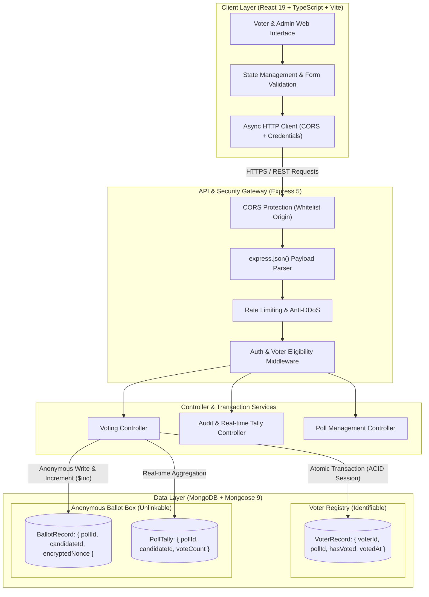
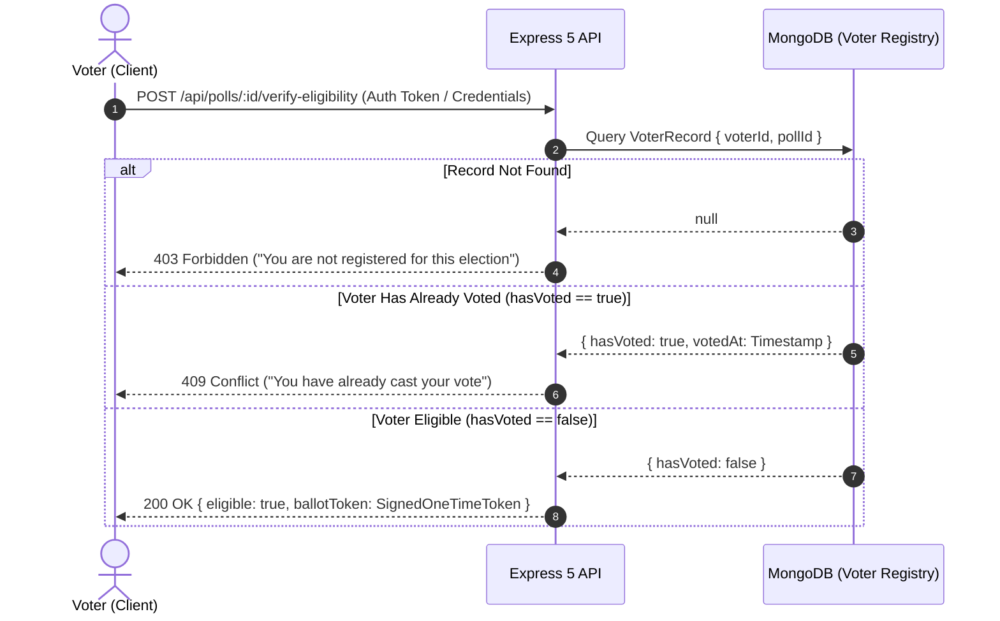
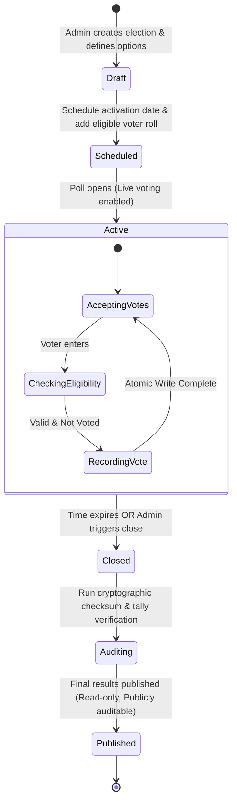

# 🗳️ One-Vote: Secure, Scalable & Tamper-Resistant Digital Voting System

> A modern, end-to-end full-stack electronic voting system designed to guarantee **"One Person, One Vote"** with ballot secrecy, cryptographic integrity, and concurrency-safe double-voting prevention.

---

## 📌 Table of Contents
1. [Executive Summary & Core Objectives](#-executive-summary--core-objectives)
2. [The Core Architectural Problem](#-the-core-architectural-problem)
3. [System Architecture Flow Charts](#-system-architecture-flow-charts)
   - [High-Level Architecture](#1-high-level-system-architecture)
   - [Voter Verification & Eligibility Flow](#2-voter-verification--eligibility-flow)
   - [Concurrency-Safe Voting Transaction Flow](#3-concurrency-safe-vote-submission-flow)
   - [Election State Lifecycle](#4-election-state-lifecycle)
4. [Step-by-Step Working Mechanism](#-step-by-step-working-mechanism)
5. [Database Schema & Data Isolation](#-database-schema--data-isolation)
6. [Complete Tech Stack & Deep-Dive Rationale](#-complete-tech-stack--deep-dive-rationale)
   - [Why TypeScript Across the Entire Stack?](#why-typescript-across-the-entire-stack)
   - [Why React 19 on Frontend?](#why-react-19-frontend)
   - [Why Vite for Build Tooling?](#why-vite-build-tooling)
   - [Why Node.js & Express 5 on Backend?](#why-nodejs--express-5-backend)
   - [Why MongoDB & Mongoose 9 for Voting Data?](#why-mongodb--mongoose-9-database)
   - [Why CORS & Dotenv Security Setup?](#why-cors--dotenv-security-setup)
7. [Directory Structure](#-directory-structure)
8. [Setup & Execution Guide](#-setup--execution-guide)
9. [Security Considerations & Anti-Fraud Mechanisms](#-security-considerations--anti-fraud-mechanisms)

---

## 📖 Executive Summary & Core Objectives

**One-Vote** is engineered to bring transparency, cryptographic assurance, and real-time reliability to digital decision-making, governance elections, and community polling.

In physical ballot voting, a citizen shows an ID to get a stamp (proving eligibility), walks behind a private curtain to mark a paper ballot (ballot secrecy), and drops it into a locked box (immutable record). 

**One-Vote reproduces this exact triad digitally:**
1. **Guaranteed Eligibility:** Only authorized users can cast a ballot.
2. **Strict Single-Vote Invariant:** Under high concurrency or network retries, no user can ever cast more than one vote.
3. **Anonymity & Ballot Secrecy:** Decoupling voter identity from their candidate/choice to prevent voter intimidation or coercion.
4. **Auditability & Tamper-Evidence:** Instant, verifiable tally aggregation without exposing individual voter identities.

---

## ⚖️ The Core Architectural Problem

Digital voting systems suffer from the **"Voting Paradox"**:
- **Requirement A:** The system must strictly verify *who* is voting to enforce the "one-person-one-vote" rule.
- **Requirement B:** The system must strictly *never* store who voted for which option, protecting voter privacy.
- **Requirement C (Race Conditions):** If a malicious voter opens 10 browser tabs and submits votes simultaneously at millisecond intervals, traditional databases without atomic locks or compound unique constraints will register multiple votes before the first request finishes writing.

**One-Vote solves this using a Dual-Record Cryptographic Separation pattern backed by MongoDB ACID Transactions & Unique Indexes.**

---

## 📊 System Architecture Flow Charts

### 1. High-Level System Architecture



---

### 2. Voter Verification & Eligibility Flow



---

### 3. Concurrency-Safe Vote Submission Flow

This diagram illustrates how One-Vote prevents race conditions when concurrent duplicate requests are fired:

```mermaid
sequenceDiagram
    autonumber
    actor Voter as Voter Browser
    participant API as Express Controller
    participant Session as Mongo Multi-Doc Transaction
    participant Registry as Voter Registry Collection
    participant Box as Anonymous Ballot Box
    participant Tally as Poll Tally Collection

    Voter->>API: POST /api/polls/:id/vote { candidateId, oneTimeToken }
    API->>API: Validate input schema & verify Token signature
    
    API->>Session: Start mongoose.startSession() -> startTransaction()
    
    rect rgb(240, 248, 255)
        Note over API,Registry: Step 1: Atomic Check-and-Set Lock
        API->>Registry: findOneAndUpdate({ voterId, pollId, hasVoted: false }, { $set: { hasVoted: true, votedAt: now } })
        alt Voter already marked as voted (or concurrent collision)
            Registry-->>API: null (Document not modified)
            API->>Session: abortTransaction()
            API-->>Voter: 400 Bad Request ("Vote already recorded or invalid session")
        else Successfully claimed voting right
            Registry-->>API: Updated VoterRecord
            
            Note over API,Box: Step 2: Push Anonymous Vote (No voter identity attached)
            API->>Box: insertOne({ pollId, candidateId, timestamp })
            
            Note over API,Tally: Step 3: Atomic Increment
            API->>Tally: updateOne({ pollId, candidateId }, { $inc: { count: 1 } }, { upsert: true })
            
            API->>Session: commitTransaction()
            API-->>Voter: 200 OK { success: true, receiptHash: "0xabc..." }
        end
    end
```

---

### 4. Election State Lifecycle



---

## ⚙️ Step-by-Step Working Mechanism

### Phase 1: Election Initialization (Admin Configuration)
1. **Poll Creation**: An organizer defines the election title, description, candidates/options, start/end timestamps, and voting rules.
2. **Voter Roll Registration**: The organizer imports eligible voter identifiers (emails, employee IDs, or student roll numbers).
3. **Registry Generation**: For every eligible voter, a document is created in the `VoterRegistry` with `hasVoted: false` and a unique compound index on `(pollId, voterIdentifier)`.

### Phase 2: Voter Authentication & Eligibility Check
1. The voter logs in via the React frontend.
2. The client requests the active ballot by calling `GET /api/polls/:id/ballot`.
3. The Express server validates:
   - Is the election status currently `Active`?
   - Is the current server time between `startDate` and `endDate`?
   - Is the voter present in the registry for this `pollId`?
   - Has `hasVoted` remained `false`?
4. If valid, the frontend renders the interactive ballot UI.

### Phase 3: Casting the Ballot (Guaranteed Single Vote & Privacy)
1. The voter selects their choice and clicks **"Submit Vote"**.
2. To prevent accidental double clicks or malicious spam attacks, the React UI immediately disables the submit button and enters a loading state.
3. The request hits `POST /api/polls/:id/vote`.
4. **Atomic Check-and-Set**: The backend begins a MongoDB session transaction:
   - Attempts an atomic update on `VoterRegistry` using `{ voterId, pollId, hasVoted: false }`.
   - If another concurrent request from the same user succeeded even 1 millisecond earlier, this query returns `null`. The transaction immediately aborts.
5. **Decoupled Ballot Storage**:
   - The vote is inserted into the `Ballots` collection **without** the voter's identity. Only `pollId`, `candidateId`, and a cryptographic salt/hash are saved.
   - The running counter in `PollTally` is updated atomically using MongoDB's `$inc: { votes: 1 }`.
6. The transaction commits. A deterministic receipt hash is returned to the user confirming their vote was counted.

### Phase 4: Real-time Tallying & Transparent Audits
- Votes can be displayed live or held until the poll is closed, depending on election settings.
- Because the voter identity is physically severed from the ballot document, even database administrators cannot inspect *who* voted for *whom*, yet the total tally matches the exact count of voters where `hasVoted === true`.

---

## 🗄️ Database Schema & Data Isolation

```
=====================================================================
                      DATABASE COLLECTIONS
=====================================================================

1. Polls Collection
   ├── _id: ObjectId
   ├── title: String
   ├── description: String
   ├── status: "draft" | "active" | "closed"
   ├── candidates: [ { id: String, name: String, avatarUrl: String } ]
   ├── startsAt: Date
   ├── endsAt: Date
   └── createdAt: Date

2. VoterRegistry Collection (IDENTIFIABLE TIER - Who can vote?)
   ├── _id: ObjectId
   ├── pollId: ObjectId (Indexed)
   ├── voterId: String (Hash of Email / Student ID / Wallet)
   ├── hasVoted: Boolean (Default: false)
   ├── votedAt: Date | null
   └── UNIQUE COMPOUND INDEX: { pollId: 1, voterId: 1 }

3. Ballots Collection (ANONYMOUS TIER - What was voted?)
   ├── _id: ObjectId
   ├── pollId: ObjectId (Indexed)
   ├── candidateId: String
   ├── castAt: Date
   └── receiptSignature: String (SHA-256 integrity hash)
   NOTE: Intentionally NO reference to voterId!

4. PollTally Collection (AGGREGATE TIER - Quick read queries)
   ├── _id: ObjectId
   ├── pollId: ObjectId
   ├── candidateId: String
   ├── totalVotes: Number (Updated via $inc)
   └── UNIQUE COMPOUND INDEX: { pollId: 1, candidateId: 1 }
```

---

## 🛠️ Complete Tech Stack & Deep-Dive Rationale

Here is why each specific technology was chosen for **One-Vote**:

| Component | Technology | Version | Purpose in One-Vote |
| :--- | :--- | :--- | :--- |
| **Frontend Framework** | **React** | `^19.2` | Declarative, component-driven UI for reactive ballot rendering and optimistic states |
| **Frontend Tooling** | **Vite** | `^8.1` | Instant HMR development server, lightning-fast ES module bundling |
| **Language (Full-Stack)**| **TypeScript** | `~6.0` | End-to-end type safety preventing null pointers and schema mismatch across API boundaries |
| **Backend Runtime** | **Node.js** | LTS | Non-blocking, event-driven runtime ideal for handling concurrent I/O voting requests |
| **Backend Framework** | **Express.js** | `^5.2` | Ultra-fast HTTP routing with native async error handling for transactional API endpoints |
| **Database & ODM** | **MongoDB & Mongoose**| `^9.7` | Document database providing ACID multi-document transactions and atomic update operators |
| **Environment Config** | **dotenv** | `^17.4` | Strict isolation of database credentials, port configs, and JWT secrets |
| **Cross-Origin Security**| **CORS** | `^2.8` | Restricts API access strictly to trusted client origins to prevent Cross-Site Request Forgery |
| **Dev Orchestration** | **ts-node-dev** | `^2.0` | Hot-reloading server process with in-memory TypeScript compilation |

---

### Why TypeScript Across the Entire Stack?
- **Zero-Tolerance for Undefined Data**: In an e-voting platform, receiving `undefined` for a `candidateId` or mistyping `hasVoted` can ruin an election or crash a route. TypeScript enforces strict contracts across both frontend and backend.
- **Shared Type Interfaces**: The request/response payloads (such as `HealthResponse`, `BallotPayload`, `PollVoteReceipt`) can be declared once and respected by both the React UI and Express controllers.
- **Refactoring Confidence**: As security constraints and new ballot types (e.g., ranked choice, multiple-choice) are introduced, TypeScript catches compile-time regressions immediately.

---

### Why React 19 (Frontend)?
- **Instant Reactive Updates**: React’s declarative model makes rendering different stages of the voting lifecycle (Checking Eligibility -> Active Ballot -> Confirm Selection -> Processing -> Voted Receipt) seamless.
- **State Isolation**: When casting a vote, the UI must immediately disable interactions to prevent double-click submissions before the server responds. React's local state management (`useState`, `useTransition`) handles pending and disabled states deterministically.
- **Modern React 19 Features**: React 19 brings improved rendering efficiency, native support for async transitions, and streamlined asset loading.

---

### Why Vite (Build Tooling)?
- **Sub-Second Hot Module Replacement (HMR)**: Unlike legacy Webpack setups, Vite uses native browser ES modules during development. Changes to UI components reflect instantly without full page reloads.
- **Optimized Production Bundling**: Vite leverages Rollup for production builds, performing aggressive tree-shaking and asset minification so voters on low-bandwidth mobile devices load the ballot in milliseconds.

---

### Why Node.js & Express 5 (Backend)?
- **Native Async Error Handling in Express 5**: Express 5 automatically catches rejected promises and async route errors without needing cumbersome `try/catch` wrapper utilities on every controller.
- **Lightweight & High Concurrency**: Node.js's event loop excels at asynchronous, I/O-heavy workloads where thousands of voters submit HTTP requests at the same moment.
- **Minimalist & Modular Middleware**: Express allows surgical placement of security layers: CORS verification -> JSON parsing -> Rate limiting -> JWT authentication -> Transactional Controller.

---

### Why MongoDB & Mongoose 9 (Database)?
- **Multi-Document ACID Transactions**: Starting in modern MongoDB, transactions allow updating the `VoterRegistry` and inserting into the `Ballots` collection inside a single atomic block. Either both succeed, or everything rolls back.
- **Atomic Mutation Operators (`$set`, `$inc`)**: MongoDB provides native atomic operations at the storage engine level (WiredTiger). Using `$inc` for candidate votes prevents lost updates under concurrent submissions without requiring heavy table-locking.
- **Compound Unique Indexes**: A MongoDB unique compound index `{ pollId: 1, voterId: 1 }` on the `VoterRegistry` enforces the "One Person, One Vote" rule at the database engine level, making duplicate vote creation physically impossible even under severe race conditions.
- **Flexible Poll Schemas**: Different polls may have varied metadata (single choice, multi-choice, referendum with binary Yes/No). Document schemas in MongoDB accommodate this flexibility cleanly.

---

### Why CORS & Dotenv (Security Setup)?
- **CORS (Cross-Origin Resource Sharing)**: Prevents malicious external domains from executing unauthorized voting scripts on behalf of logged-in voters. The backend explicitly allows only trusted origins (e.g., `http://localhost:5173` in development and the production domain).
- **Dotenv**: Keeps critical secrets (database URIs, session keys, server ports) out of the git version history, ensuring compliance with twelve-factor application security principles.

---

## 📁 Directory Structure

```
One-Vote/
├── client/                     # Frontend Application (React 19 + TypeScript + Vite)
│   ├── public/                 # Static public assets (icons, favicon)
│   ├── src/
│   │   ├── assets/             # Images and SVG icons
│   │   ├── App.tsx             # Main Voting / Health View & Navigation
│   │   ├── App.css             # Component-level styling
│   │   ├── index.css           # Global CSS variables & layout styling
│   │   └── main.tsx            # React root mount point
│   ├── index.html              # HTML5 entry page with SEO metadata
│   ├── package.json            # Client dependencies (React 19, Vite, ESLint)
│   ├── tsconfig.json           # Root TypeScript configuration
│   └── vite.config.ts          # Vite build & development server config
│
├── server/                     # Backend Application (Node.js + Express 5 + TypeScript)
│   ├── src/
│   │   ├── server.ts           # Express server entry point, CORS & Routes
│   │   ├── models/             # (Planned) Mongoose schemas (Poll, Voter, Ballot)
│   │   ├── controllers/        # (Planned) Business logic for voting & tallying
│   │   └── middleware/         # (Planned) Auth & concurrency protection middleware
│   ├── package.json            # Server dependencies (Express 5, Mongoose 9, CORS, Dotenv)
│   └── tsconfig.json           # Server TypeScript compiler configuration
│
├── file.text                   # Initial setup scripts & commands log
└── README.md                   # Complete architectural & technical documentation
```

---

## 🚀 Setup & Execution Guide

### Prerequisites
- **Node.js**: v18.0.0 or higher
- **npm**: v9.0.0 or higher
- **MongoDB**: Local instance running on `mongodb://localhost:27017` or MongoDB Atlas URI

---

### 1. Backend Setup
```bash
# Navigate to the server folder
cd server

# Install dependencies (Express 5, Mongoose 9, TypeScript, etc.)
npm install

# Create environment file
cat <<EOF > .env
PORT=5001
MONGODB_URI=mongodb://localhost:27017/one-vote
CLIENT_ORIGIN=http://localhost:5173
EOF

# Run development server with hot-reload
npm run dev
```
> Server will boot at: `http://localhost:5001` (Health check at `/api/health`)

---

### 2. Frontend Setup
```bash
# In a new terminal tab, navigate to the client folder
cd client

# Install dependencies (React 19, Vite 8, etc.)
npm install

# Start Vite development server
npm run dev
```
> Client will launch at: `http://localhost:5173`

---

## 🛡️ Security Considerations & Anti-Fraud Mechanisms

1. **Replay & Sybil Attack Mitigation**:
   - Each ballot submission requires a signed, short-lived ballot nonce/token tied to the voter's active session. Once a vote transaction commits, that token is permanently invalidated.
2. **Client-Side Optimistic Lock + Server Hard Enforcement**:
   - Frontend disables the vote button immediately upon click to prevent double submits.
   - Server uses database-level atomic conditional queries (`hasVoted: false`) so even scripted API requests cannot execute more than once.
3. **Zero-Knowledge Separation**:
   - Voter IDs are never attached to the ballot options. Even if the database is dumped or leaked, individual voting choices remain anonymous.
4. **CORS Hardening**:
   - Strict origin validation ensures requests can only be initiated from the authorized frontend client.
5. **Sanitization**:
   - All input parameters are validated against strict TypeScript interfaces to prevent NoSQL injection or malformed payload attacks.

---

<p align="center">
  <b>One-Vote</b> — Safeguarding democratic integrity through modern software architecture.
</p>
